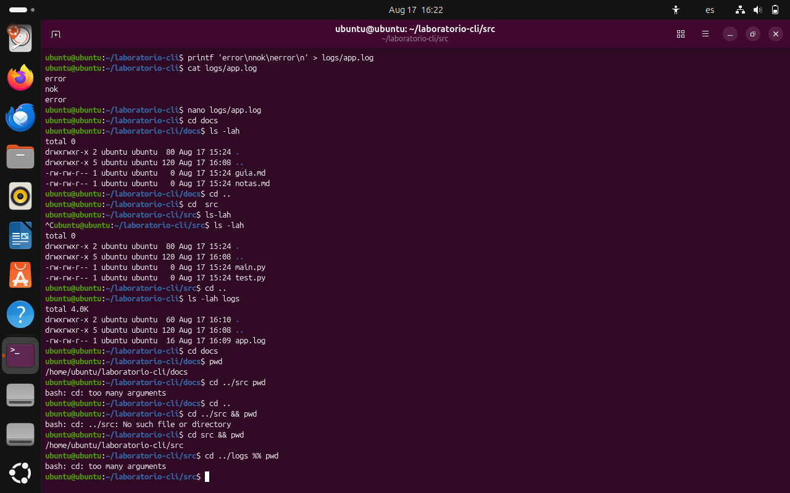

md_content = """# Resumen de Permisos y Captura de Terminal

## Tabla de Archivos y Permisos

| Archivo / Directorio | Permisos (Simbólico) | Permisos (Numérico) |
| :--- | :--- | :--- |
| `README.TXT` | `rw-rw-r--` | `664` |
| `docs`       | `rwxrwxr-x` | `775` |
| `src`        | `rwxrwxr-x` | `775` |
| `logs`       | `rwxrwxr-x` | `775` |

### Valores Numéricos de Permisos
* **r** (Lectura) = 4
* **w** (Escritura) = 2
* **x** (Ejecución) = 1

## Captura de Pantalla

"""

file_path = "/mnt/data/lah.md"
with open(file_path, "w", encoding="utf-8") as f:
    f.write(md_content)

print(f"File created successfully at {file_path}")
